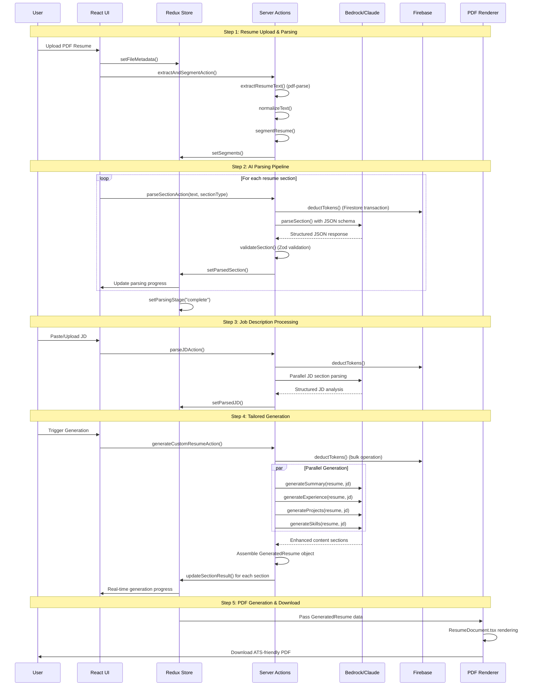

# 🏗️ ResumeBro System Design Document

**Project**: ResumeBro - AI-Powered Resume Intelligence Platform  
**Version**: 1.0 (MVP)  
**Date**: January 2026  
**Target**: Amazon AI for Bharat Hackathon

---

## 1. Architecture Overview

ResumeBro follows a **serverless, client-heavy hybrid architecture** built on Next.js 16 with App Router. The system implements a **Chain-of-Thought Pipeline** for AI processing, ensuring structured data flow from unstructured inputs to validated outputs.

### 1.1 Core Design Principles

- **Type Safety First**: 99% type safety through strict Zod schema validation
- **No Hallucinations**: AI strictly rephrases existing facts, never invents new information
- **Progressive Enhancement**: Multi-step wizard with real-time feedback
- **Atomic Operations**: Firestore transactions for token management and data consistency
- **Serverless Scalability**: React Server Actions for secure API interactions

---

## 2. Functional Requirements Mapping

### 2.1 Resume Parsing Module (Requirement 3.1)

**Implementation Location**: `src/lib/actions/resume-parser/`

```typescript
// Core Pipeline: Extract → Normalize → Segment → Parse → Validate
src/lib/actions/resume-parser/
├── actions.ts              // Server Actions orchestration
├── textExtraction.ts       // PDF → Raw Text (pdf-parse)
├── normalization.ts        // Text cleaning & formatting
├── segmentation.ts         // Section identification
├── blockParsing.ts         // LLM-powered structured parsing
└── validation.ts           // Zod schema validation
```

**Data Flow**:

1. **Input**: PDF file via `FormData`
2. **Extract**: `extractResumeText()` uses `pdf-parse` library
3. **Normalize**: `normalizeText()` cleans formatting artifacts
4. **Segment**: `segmentResume()` identifies sections (Time complexity: O(N))
5. **Parse Loop**: For each of the **13** identified sections (`CandidateInfo`, `Education`, `Experience`, `Projects`, `AcademicProjects`, `Skills`, `Certifications`, `Languages`, `Research`, `Extracurricular`, `Hobbies`, `Achievements`, `Summary`):
   - **Cost Check**: Verify user token balance.
   - **Deduct Tokens**: Atomic transaction to deduct cost per section.
   - **Parse**: Send segment to LLM with strict JSON schema.
6. **Validate**: `validateSection()` ensures type safety with Zod schemas
7. **Output**: Typed `ParsedResume` object

**Components**:

- `src/components/ResumeGenerator/Wizard/steps/Step1_ResumeInput/`
- `src/components/ResumeParser/` (Standalone parsing interface)

### 2.2 Job Description Parsing Module (Requirement 3.2)

**Implementation Location**: `src/lib/actions/jd-parser/`

```typescript
src/lib/actions/jd-parser/
├── actions.ts              // JD parsing orchestration
├── segmentation.ts         // JD section identification
├── blockParsing.ts         // LLM parsing with JD-specific prompts
├── validation.ts           // JD schema validation
└── parsers/                // Section-specific parsers
    ├── overview.ts
    ├── requirements.ts
    ├── responsibilities.ts
    ├── eligibility.ts
    ├── jobDetails.ts
    └── selectionProcess.ts
```

**Data Flow**:

1. **Input**: Raw JD text (paste/upload)
2. **Segment**: `segmentJobDescription()` identifies JD sections
3. **Token Deduction**: A single **bulk deduction** covers the analysis of all segments (`JobDetails`, `Overview`, `Requirements`, `Responsibilities`, `Eligibility`, `SelectionProcess`).
4. **Parse**: Parallel parsing of these 6 fields.
5. **Validate**: `validateJDSection()` ensures structured output
6. **Output**: Typed `ParsedJobDescription` object

**Components**:

- `src/components/ResumeGenerator/Wizard/steps/Step3_JDInput/`
- `src/components/JDParser/` (Standalone JD parsing interface)

### 2.3 Tailored Generation Engine (Requirement 3.3)

**Implementation Location**: `src/lib/actions/resume-generation/`

```typescript
src/lib/actions/resume-generation/
├── generate.ts             // Orchestration & parallel execution
├── generators/             // Section-specific generators
│   ├── summary.ts          // Professional summary tailoring
│   ├── experience.ts       // Experience bullet point optimization
│   ├── projects.ts         // Project description enhancement
│   ├── skills.ts           // Skills prioritization & keyword injection
│   └── academicProjects.ts // Academic project tailoring
└── utils/
    └── contextUtils.ts     // JD context extraction utilities
```

**AI Strategy**:

1. **Gap Analysis**: internal comparison of Resume Skills vs JD Requirements.
2. **Dynamic Generation** (Cost Incurred):
   - **Target Sections**: `Summary`, `Experience`, `Projects`, `AcademicProjects`, `Skills` (only these 5).
   - **Deduct Tokens**: Transactional deduction for each specific generated section.
   - **Context-Aware Rewrite**: LLM rephrases content using extracted JD keywords.
3. **Static Copy** (No Cost): Direct mapping of factual sections (`Education`, `ContactInfo`, `Certifications`, `Languages`, `Research`, `Extracurricular`, `Hobbies`, `Achievements`).
4. **Parallel Processing**: All generators run concurrently for performance

**Anti-Hallucination Measures**:

1. **Strict Input Validation**: Only existing resume data is passed to generators
2. **Contextual Prompting**: Prompts explicitly instruct to "rephrase existing content only"
3. **Fact Preservation**: Original achievements and dates are preserved
4. **Keyword Integration**: JD keywords are naturally woven into existing descriptions

### 2.4 PDF Rendering & Download (Requirement 3.4)

**Implementation Location**: `src/components/ResumeRenderer/`

```typescript
src/components/ResumeRenderer/
├── ResumeDocument.tsx      // @react-pdf/renderer Document
├── ResumePreview.tsx       // Real-time preview component
├── styles.ts               // PDF styling definitions
└── sections/               // Modular PDF sections
    ├── Header.tsx
    ├── Summary.tsx
    ├── Experience.tsx
    ├── Projects.tsx
    ├── Skills.tsx
    └── ...
```

**Features**:

- **Real-time Preview**: Live PDF preview during generation
- **ATS-Friendly**: Clean, parseable formatting
- **Responsive Layout**: Automatic page breaks and spacing
- **Modular Sections**: Each section is independently rendered

### 2.5 User Dashboard (Requirement 3.5)

**Implementation Location**: `src/components/Dashboard/`

```typescript
src/components/Dashboard/
├── index.tsx               // Main dashboard layout
└── _components/
    ├── UserProfile/        // Token balance & usage analytics
    ├── ResumeList/         // Saved resume management
    ├── JDList/             // JD history
    ├── GeneratedResumeList/ // Tailored resume versions
    └── Sidebar/            // Navigation
```

**Features**:

- **Token Management**: Real-time balance display with usage tracking
- **Version Control**: Save and manage multiple resume versions
- **Usage Analytics**: Parsing history and generation statistics
- **Secure Access**: Firebase Auth integration

---

## 3. Amazon Bedrock Integration Architecture

### 3.1 LLM Provider Setup (Bharat-Optimized)

**Implementation**: `src/lib/llm/provider.ts`

To ensure compliance with Indian data residency preferences and minimize latency for users on variable mobile networks (4G/5G), we prioritize the **Mumbai Region (ap-south-1)**.

```typescript
// Bedrock Integration Path:
export async function generateBedrockText(
  options: GenerateTextOptions,
): Promise<string> {
  // Region set to Mumbai for lowest latency in India
  const client = new BedrockRuntimeClient({ region: "ap-south-1" });

  const command = new InvokeModelCommand({
    // Using Claude 3 Sonnet (or 3.5 if available) for optimal reasoning/cost ratio
    modelId: "anthropic.claude-3-sonnet-20240229-v1:0",
    contentType: "application/json",
    accept: "application/json",
    body: JSON.stringify({
      anthropic_version: "bedrock-2023-05-31",
      max_tokens: 4000,
      temperature: 0.1, // Strict factual adherence
      messages: [
        {
          role: "user",
          content: `${options.systemPrompt}\n\n${options.userPrompt}`,
        },
      ],
    }),
  });

  const response = await client.send(command);
  return JSON.parse(new TextDecoder().decode(response.body)).content[0].text;
}
```

### 3.2 Claude 3.5 Sonnet for Tailored Generation

**Model Selection Rationale**:

- **Claude 3.5 Sonnet**: Optimal balance of reasoning capability and cost efficiency
- **Context Window**: 200K tokens - handles large resumes + JD context
- **Instruction Following**: Superior adherence to "no hallucination" constraints
- **JSON Reliability**: Consistent structured output generation

**Integration Points**:

1. **Resume Parsing**: Section-by-section parsing with strict JSON schemas
2. **JD Analysis**: Requirement extraction and keyword identification
3. **Content Generation**: Context-aware resume tailoring
4. **Quality Assurance**: Fact-checking and consistency validation

### 3.3 Prompt Engineering Strategy

**System Prompts** (Anti-Hallucination Focus):

```typescript
const GENERATION_SYSTEM_PROMPT = `
You are a professional resume writer. Your task is to enhance existing resume content 
by rephrasing and optimizing it for a specific job description.

CRITICAL CONSTRAINTS:
1. NEVER invent new experiences, skills, or achievements
2. ONLY rephrase and optimize existing content
3. Preserve all dates, company names, and factual details
4. Naturally integrate relevant keywords from the job description
5. Maintain the candidate's authentic voice and experience level

INPUT: Original resume section + Target job description
OUTPUT: Enhanced version of the SAME content, optimized for the target role
`;
```

---

## 4. Data Flow Architecture

### 4.1 Complete System Flow Diagram



### 4.2 State Management Flow

**Redux Store Structure**:

```typescript
store: {
  tailoredResumeParser: {
    data: {
      status: "idle" | "extracting" | "segmenting" | "parsing" | "complete" | "error",
      rawText: string,
      segments: Record<string, string>,
      sectionStatus: Record<string, SectionStatus>,
      parsedResume: ParsedResume,
      sectionErrors: Record<string, string>
    }
  },
  tailoredJDParser: {
    status: ParsingStage,
    parsedJD: ParsedJobDescription,
    sectionStatuses: Record<string, SectionStatus>
  },
  tailoredResumeGeneration: {
    status: GenerationStage,
    sectionStatuses: Record<string, GenerationStage>,
    generatedResume: GeneratedResume,
    sectionPrompts: Record<string, string> // Debug data
  }
}
```

---

## 5. Non-Functional Requirements Implementation

### 5.1 Performance Optimization

**Latency Targets**:

- **Parsing**: < 5 seconds per operation ✅
- **Full Generation**: < 30 seconds ✅

**Implementation Strategies**:

1. **Parallel Processing**: All AI operations run concurrently
2. **Streaming Updates**: Real-time progress indicators via Redux
3. **Optimistic UI**: Immediate feedback for user actions
4. **Efficient Tokenization**: Smart prompt engineering to minimize token usage

### 5.2 "No Hallucinations" Guarantee

**Technical Implementation**:

1. **Input Validation**:

   ```typescript
   // Only existing resume data is passed to generators
   const validatedInput = ParsedResumeSchema.parse(resumeData);
   ```

2. **Prompt Engineering**:

   ```typescript
   const systemPrompt = `
   CRITICAL: You must ONLY rephrase existing content. 
   Do NOT add new experiences, skills, or achievements.
   Preserve all factual details (dates, companies, degrees).
   `;
   ```

3. **Output Validation**:

   ```typescript
   // Fact-checking against original data
   function validateGeneratedContent(
     original: ParsedResume,
     generated: GeneratedResume,
   ) {
     // Ensure no new experiences added
     // Verify date consistency
     // Check company name preservation
   }
   ```

4. **Audit Trail**:
   ```typescript
   // Debug prompts stored for transparency
   state.sectionPrompts[section] = debugPrompt;
   ```

### 5.3 Security & Privacy

**Data Protection**:

- **Firebase Auth**: Secure user authentication
- **Server Actions**: All AI operations server-side only
- **Token Management**: Atomic Firestore transactions
- **No Data Persistence**: Resume content not stored permanently

**Privacy Measures**:

- **Ephemeral Processing**: Data exists only during active session
- **Secure Transmission**: HTTPS for all API communications
- **Access Control**: User-scoped data access only

### 5.4 Error Handling & Reliability

**Graceful Degradation**:

```typescript
function getErrorMessage(error: any): string {
  if (error.message.includes("token"))
    return "Insufficient tokens to process this resume.";
  if (error.message.includes("JSON"))
    return "AI model returned invalid format. Please retry.";
  if (error.message.includes("network"))
    return "Network error. Please check your connection.";
  return error.message;
}
```

**Fallback Strategies**:

- **Retry Logic**: Automatic retry for transient failures
- **Partial Success**: Continue processing even if some sections fail
- **User Feedback**: Clear error messages with actionable guidance

---

## 6. Technology Stack Integration

### 6.1 Core Technologies

- **Framework**: Next.js 16 with App Router
- **Language**: TypeScript 5 (strict mode)
- **State Management**: Redux Toolkit
- **AI Integration**: AWS Bedrock (Claude 3.5 Sonnet)
- **Database**: Cloud Firestore
- **Authentication**: Firebase Auth
- **PDF Processing**: @react-pdf/renderer + pdf-parse
- **Validation**: Zod schemas

### 6.2 Development Workflow

```bash
# Development
npm run dev          # Start development server

# Production
npm run build        # Build for production
npm run start        # Start production server

# Code Quality
npm run lint         # ESLint validation
```

### 6.3 Environment Configuration

```env
# Firebase Configuration
NEXT_PUBLIC_FIREBASE_API_KEY=
NEXT_PUBLIC_FIREBASE_PROJECT_ID=
FIREBASE_CLIENT_EMAIL=
FIREBASE_PRIVATE_KEY=

# AWS Bedrock Configuration
AWS_ACCESS_KEY_ID=
AWS_SECRET_ACCESS_KEY=
AWS_REGION=us-east-1

# Fallback LLM Provider
OPENROUTER_API_KEY=
```

---

## 7. Deployment & Scalability

### 7.1 Serverless Architecture Benefits

- **Auto-scaling**: Handles traffic spikes automatically
- **Cost Efficiency**: Pay-per-request pricing model
- **Global Distribution**: Edge deployment for low latency
- **Zero Maintenance**: No server management required

### 7.2 Performance Monitoring

- **Token Usage Tracking**: Real-time cost monitoring
- **Error Rate Monitoring**: AI operation success rates
- **Latency Metrics**: End-to-end processing times
- **User Analytics**: Feature usage and conversion tracking

---

## 8. Future Enhancements

### 8.1 Advanced AI Features

- **Multi-language Support**: Resume generation in regional languages
- **Industry Specialization**: Domain-specific optimization
- **ATS Score Prediction**: Pre-generation compatibility scoring
- **Interview Preparation**: AI-generated interview questions

### 8.2 Platform Extensions

- **API Access**: Developer API for third-party integrations
- **Bulk Processing**: Enterprise batch processing capabilities
- **Template Marketplace**: Custom resume templates
- **Collaboration Tools**: Team-based resume review workflows

---

**Document Version**: 1.0  
**Last Updated**: January 25, 2026  
**Next Review**: Post-Hackathon Implementation Phase
